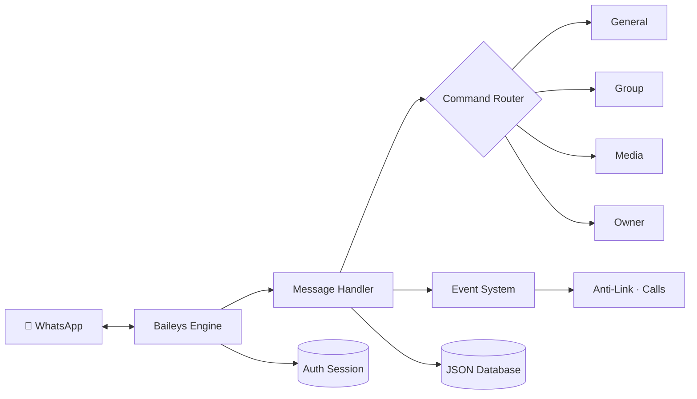

# ⚛️ Atomic-md

<div align="center">


<br/><br/>


# ⚛️ Atomic-md

### *Professional WhatsApp Multi-Device Bot*

**Powerful. Modular. Self-hosted. Built for the future.**

<br/>

[](https://github.com/maxamedawil703-cmyk/Atomic-md/releases)
[](LICENSE)
[](https://nodejs.org)
[](https://github.com/WhiskeySockets/Baileys)
[](https://github.com/maxamedawil703-cmyk/Atomic-md/stargazers)
[](https://github.com/maxamedawil703-cmyk/Atomic-md/network/members)
[](https://github.com/maxamedawil703-cmyk/Atomic-md/issues)

<br/>

[**🚀 Get Started**](#-installation) ·
[**📖 Commands**](#-commands) ·
[**☁️ Deploy**](#️-deployment) ·
[**🤝 Contribute**](#-contributing) ·
[**📬 Contact**](#-contact--support)

</div>

---

## 📌 About

**Atomic-md** is a next-generation WhatsApp bot engineered with precision, performance, and professionalism. Built on the powerful [Baileys](https://github.com/WhiskeySockets/Baileys) library, it delivers a secure, modular, and fully self-hosted automation experience.

Unlike bloated bots that rely on remote code execution, **Atomic-md** runs **100% locally** — giving you full control, transparency, and reliability.

<div align="center">

| ⚡ Fast | 🔒 Secure | 🧩 Modular | ☁️ Deploy-Ready |
|:---:|:---:|:---:|:---:|
| Lightweight core | No remote `eval()` | Plugin architecture | Heroku · VPS · Railway |

</div>

---

## ✨ Features

<table>
<tr>
<td width="50%" valign="top">

### 🤖 Core Engine
- ⚛️ Professional plugin command system
- 📱 QR code pairing — no session service needed
- 🔄 Auto-reconnect & session persistence
- 🌐 Built-in health-check web server

</td>
<td width="50%" valign="top">

### 👥 Group Management
- 🦵 Kick, promote & demote members
- 📢 Tag all group participants
- 📋 Detailed group information
- 🚫 Anti-link protection

</td>
</tr>
<tr>
<td width="50%" valign="top">

### 🎨 Media Tools
- 🖼️ Image-to-sticker conversion
- ✨ Custom sticker pack support
- 📦 Lightweight Jimp processing

</td>
<td width="50%" valign="top">

### 🔐 Owner Controls
- 🔒 Public / private mode toggle
- 🚫 Ban & unban users
- 👤 Owner-only command access
- ⚙️ Full environment configuration

</td>
</tr>
</table>

---

## 🖼️ Preview

<div align="center">


<sub>⚛️ Atomic-md running in terminal — scan QR and go live in seconds</sub>

</div>

---

## 🏗️ Architecture



<details>
<summary><b>📁 Project Structure</b></summary>

<br/>

```
Atomic-md/
├── 📄 index.js              # Application entry point
├── ⚙️ config.js             # Environment configuration
├── 📂 commands/             # Plugin-based commands
│   ├── general/             # menu · ping · alive
│   ├── group/               # kick · promote · tagall
│   ├── media/               # sticker · take
│   └── owner/               # mode · ban · unban
├── 📂 lib/                  # Core engine libraries
├── 📂 events/               # Event handlers
├── 📂 assets/               # Branding & media
├── 🔐 auth/                 # Session storage (auto-generated)
└── 💾 data/                 # JSON database
```

</details>

---

## 📋 Prerequisites

| Requirement | Details |
|-------------|---------|
| 🟢 **Node.js** | v18.0.0 or higher |
| 📦 **npm** | Comes with Node.js |
| 📱 **WhatsApp** | Active account for pairing |
| 💻 **Terminal** | Windows, macOS, or Linux |

---

## 🚀 Installation

### 1️⃣ Clone the Repository

```bash
git clone https://github.com/maxamedawil703-cmyk/Atomic-md.git
cd Atomic-md
```

### 2️⃣ Install Dependencies

```bash
npm install
```

### 3️⃣ Configure Environment

```bash
cp set.env.example set.env
```

Edit `set.env` with your details:

```env
OWNER_NUMBER=252637824865
PREFIX=.
BOT_NAME=Atomic-md
OWNER_NAME=𝗦ԩĕ𝗶𝗸𝗵 ᤂ𝗗𝗿𝗶𝗲𝗻𖣔ꠋꠋꠋꠋꠋꠋꠋꠋꠋꠋꠋꠋꠋꠋꠋꠋꠋꠋꠋꠋꠋꠋꠋꠋꠋꠋꠋꠋꠋꠋꠋ
PUBLIC_MODE=yes
PM_PERMIT=no
GROUP_ANTILINK=no
ANTICALL=no
```

### 4️⃣ Launch the Bot

```bash
npm start
```

### 5️⃣ Pair WhatsApp

1. Open **WhatsApp** on your phone
2. Go to **Settings → Linked Devices**
3. Tap **Link a Device**
4. Scan the QR code shown in your terminal

> ✅ Once connected, you'll see: `Atomic-md is online!`

---

## ☁️ Deployment

<details>
<summary><b>🟣 Heroku</b></summary>

<br/>

1. Fork this repository
2. Create a new Heroku app
3. Set environment variables from `set.env.example`
4. Deploy — `Procfile` starts the bot automatically

[](https://heroku.com/deploy?template=https://github.com/maxamedawil703-cmyk/Atomic-md)

</details>

<details>
<summary><b>🟢 VPS / Local (PM2)</b></summary>

<br/>

```bash
npm install -g pm2
npm install
pm2 start index.js --name Atomic-md
pm2 save
pm2 startup
```

</details>

<details>
<summary><b>🔵 Railway / Render</b></summary>

<br/>

1. Connect your GitHub repository
2. Set `OWNER_NUMBER` and other env vars
3. Build command: `npm install`
4. Start command: `npm start`

</details>

---

## 📖 Commands

<div align="center">

### 🌐 General

| Command | Description | Access |
|---------|-------------|--------|
| `.menu` | Display full command menu | Everyone |
| `.alive` | Check bot status & uptime | Everyone |
| `.ping` | Test response latency | Everyone |

### 👥 Group Admin

| Command | Description | Access |
|---------|-------------|--------|
| `.kick @user` | Remove a group member | Admin |
| `.promote @user` | Promote member to admin | Admin |
| `.demote @user` | Demote a group admin | Admin |
| `.tagall` | Mention all participants | Admin |
| `.groupinfo` | Show group details | Everyone |

### 🎨 Media

| Command | Description | Access |
|---------|-------------|--------|
| `.sticker` | Convert image to sticker *(reply)* | Everyone |
| `.take` | Create custom sticker *(reply)* | Everyone |

### 🔐 Owner

| Command | Description | Access |
|---------|-------------|--------|
| `.mode public` | Enable public mode | Owner |
| `.mode private` | Enable private mode | Owner |
| `.ban @user` | Ban user from bot | Owner |
| `.unban @user` | Remove user ban | Owner |

</div>

---

## 🧩 Create Your Own Command

Add a new file inside `commands/<category>/`:

```js
module.exports = {
  name: 'hello',
  description: 'Greet users',
  ownerOnly: false,   // optional
  groupOnly: false,   // optional
  run: async ({ sock, msg, config }) => {
    await sock.sendMessage(msg.key.remoteJid, {
      text: `⚛️ Hello from *${config.botName}*!`,
    }, { quoted: msg });
  },
};
```

Restart the bot — your command loads automatically. No extra wiring needed.

---

## ⚙️ Environment Variables

| Variable | Description | Default |
|----------|-------------|---------|
| `OWNER_NUMBER` | Owner phone (no `+`) | — |
| `OWNER_NAME` | Owner display name | `Owner` |
| `BOT_NAME` | Bot display name | `Atomic-md` |
| `PREFIX` | Command prefix | `.` |
| `PUBLIC_MODE` | Public access (`yes`/`no`) | `yes` |
| `PM_PERMIT` | Block PM when private | `no` |
| `GROUP_ANTILINK` | Delete links in groups | `no` |
| `ANTICALL` | Auto-reject calls | `no` |
| `SESSION_ID` | Optional session string | — |

---

## 🤝 Contributing

Contributions make **Atomic-md** better for everyone. We welcome:

- 🐛 Bug reports & fixes
- ✨ New commands & features
- 📝 Documentation improvements
- 🎨 UI/UX enhancements

### How to Contribute

1. **Fork** the repository
2. **Create** a feature branch (`git checkout -b feature/amazing-feature`)
3. **Commit** your changes (`git commit -m 'Add amazing feature'`)
4. **Push** to the branch (`git push origin feature/amazing-feature`)
5. **Open** a Pull Request

Please read our contribution guidelines before submitting.

---

## 📬 Contact & Support

<div align="center">

| Channel | Link |
|---------|------|
| 📦 **Repository** | [github.com/maxamedawil703-cmyk/Atomic-md](https://github.com/maxamedawil703-cmyk/Atomic-md) |
| 🐛 **Issues** | [Report a Bug](https://github.com/maxamedawil703-cmyk/Atomic-md/issues) |
| 💬 **Discussions** | [GitHub Discussions](https://github.com/maxamedawil703-cmyk/Atomic-md/discussions) |
| 👤 **Owner** | 𝗦ԩĕ𝗶𝗸𝗵 ᤂ𝗗𝗿𝗶𝗲𝗻𖣔ꠋꠋꠋꠋꠋꠋꠋꠋꠋꠋꠋꠋꠋꠋꠋꠋꠋꠋꠋꠋꠋꠋꠋꠋꠋꠋꠋꠋꠋꠋꠋ |
| 📱 **WhatsApp** | `+252 637 824865` |

<br/>

⭐ **Star this repo** if you find Atomic-md useful — it helps the project grow!

</div>

---

## 📜 License

This project is licensed under the **MIT License** — free to use, modify, and distribute.

See the [LICENSE](LICENSE) file for full details.

---

## ⚠️ Disclaimer

> This bot uses the **unofficial WhatsApp Web API** via Baileys. Use responsibly and in accordance with [WhatsApp's Terms of Service](https://www.whatsapp.com/legal/terms-of-service). The developers of **Atomic-md** are not responsible for any account restrictions, bans, or misuse of this software.

---

<div align="center">

**⚛️ Built with precision. Powered by Atomic-md.**

<sub>© 2026 Atomic-md · All rights reserved.</sub>

<br/>

[](https://github.com/maxamedawil703-cmyk/Atomic-md)
[](LICENSE)
[](https://github.com/maxamedawil703-cmyk/Atomic-md)

</div>
